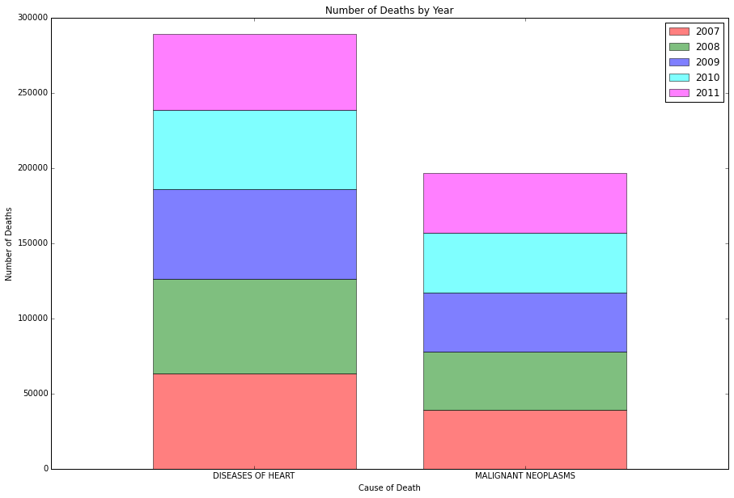

CLARITY: The plot is not crowded, and it is easy overall to determine what is being measured. The stacked bar chart makes it easy to tell the two different causes of death apparent, but makes it difficult to determine the number of victims each year, though easy to envision the total.

AESTHETIC: If the focus is on the total deaths from 2007-2011, then the stacked bar is appropriate. If the goal is to determine deaths by year, this is not the easiest to read graph. Additionally, the color scheme is somewhat distracting, and the colors are very bright. The scales are clear, though.

HONESTY: There doesn't appear to be much distortion in the graph. The stacked bar emphasizes totals over time, versus by year.

SUGGESTIONS:
     -Pick a different color scheme. Muted colors may be better, and colors that complement each other better.
     -Make sure of your audience. How you visualize this information makes it easier to imagine one way, and harder in another. The focus here is on totals. If that's the desired emphasis, then great. If not, you'll want side-by-size bars, or even use years on the X axis.
