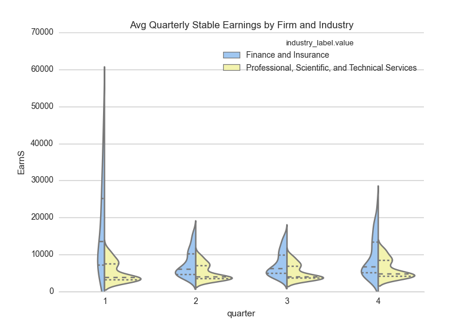

CLARITY: The plot is easy to read, and clearly shows the variables being measured. it's a violin plot, which may be confusing to a lay audience. The X label presumably means Fiscal Quarter, but could be clearer. The Y label isn't clear to me.

AESTHETIC: The colors are clear, distictive, and don't distract. The Y axis lines make each violin total clear. The location of the legend is clear and unobtrusive. Overall good job on this category.

HONESTY: Other than the distortion inherent in this kind of plot, there doesn't seem to be any significant distortion or dishonesty to the data.

SUGGESTIONS:
     -Depending on whether this is a lay audience, consider symbolizing the mean and IQR on each violin.
     -Change the title of the legend. It still had the name of the array variable.
     -Make the X and Y labels clearer.
     -It would help if the year of the data was added.
