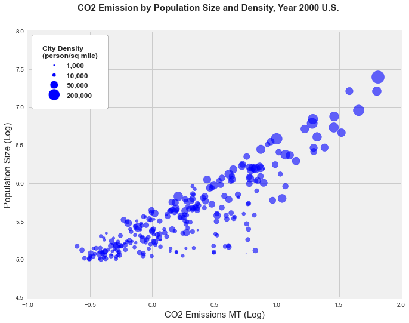

 Fore each plot create a markdown file (.md, like the README.md) in your HW8 directory in your PUI2015_name repository. Include the plot as an image that needs to be rendered in your markdown file (if the visualization is interactive also include a link to the interactive version), and your review of the plot in English prose. Please keep your reviews short: brevity is a quality! Keep each review to less than 200 words.

Think about it as a peer review, which is something that is normally done on scientific papers in order to accept them or reject them for publication.
Here are a few basic evaluation criteria you should consider:

CLARITY: is the plot easy to read? is it clear or confusing, are the quantities being visualized ambiguous?

ESTHETIC: beautiful is a subjective judgment: you should not judge the plot on the basis of whether you think it is "beautiful", but you should judge whether its esthetic is functional to what it is meant to communicate. Are the colors chosen appropriately? Are the graphical elements used appropriate to represent the quantities being visualized? Are the graphical choices allowing you to focus on the right elements or are they distracting you?

HONESTY: is the plot honestly reproducing the data or is it deforming it, perhaps to emphasize a point?

SUGGEST IMPROVEMENTS TO EACH PLOT!

