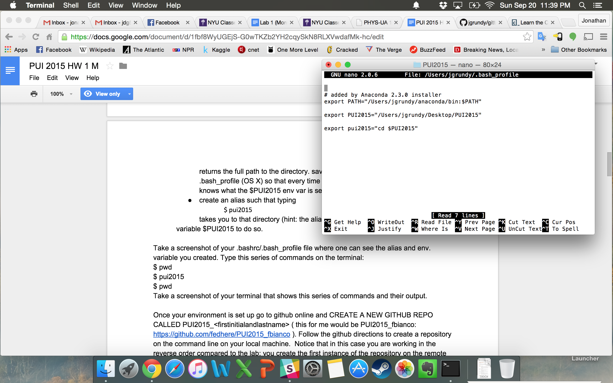

# PUI2015_jgrundy

To set up my environment, I went into the bash_profile file from my home directory using nano ~/.bash_profile, then put in the lines export PUI2015="/Users/jgrundy/Desktop/PUI2015" and export pui2015="cd $PUI2015" so that the directory would change to the relevant one. I then used source ~/.bash_profile so that I wouldn't have to reload the command line before trying the changes.

